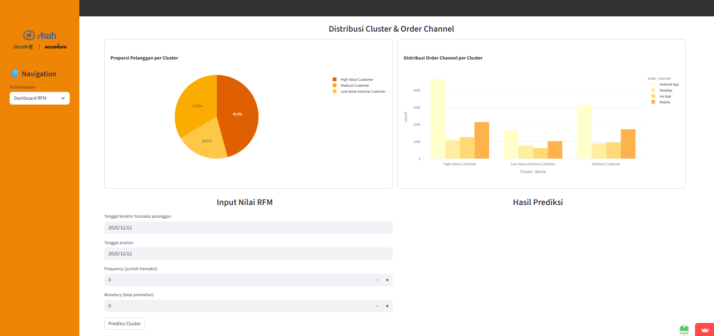

# Optimalisasi Strategi Personalized Marketing melalui Analisis RFM Berbasis Clustering
Proyek ini melakukan segmentasi pelanggan menggunakan metode RFM (Recency, Frequency, Monetary) untuk mendukung strategi pemasaran yang lebih tepat sasaran. Analisis dilengkapi dengan penerapan model machine learning dan visualisasi interaktif melalui dashboard untuk membantu pengambilan keputusan berbasis data.

# Anggota
| No | Nama | ID Anggota |
|----|--------------|----------------|
| 1  | Yansen Demos Putra Nirwana   |   M004D5Y1968  |
| 2  | Akbar Maulana | M004D5Y0125 |
| 3  |  Ghina Zulfa Inayah    | M004D5X0687 |

# Latar Belakang
Perubahan perilaku pasar di era digital menuntut strategi pemasaran yang lebih cerdas dan tepat sasaran. Namun, banyak perusahaan masih menggunakan promosi massal yang kurang relevan dengan karakteristik pelanggan, sehingga menimbulkan inefisiensi biaya dan rendahnya tingkat konversi. Untuk mengatasinya, diperlukan peralihan menuju pengambilan keputusan berbasis data melalui segmentasi pelanggan yang lebih actionable. Metode RFM (Recency, Frequency, Monetary) menjadi solusi efektif karena mampu mengukur nilai pelanggan secara kuantitatif. Dengan dukungan algoritma Machine Learning dan dashboard visualisasi, analisis pelanggan dapat dilakukan lebih cepat dan akurat untuk mendukung strategi personalized marketing.

# Tujuan
Proyek ini bertujuan untuk:
1. Menerapkan analisis RFM (Recency, Frequency, Monetary) untuk mengukur nilai pelanggan berdasarkan perilaku transaksi mereka, sehingga dapat memberikan pemahaman kuantitatif mengenai tingkat kedekatan, aktivitas, dan kontribusi pelanggan terhadap perusahaan.
2. Mengembangkan model segmentasi pelanggan yang akurat dan representatif menggunakan algoritma clustering seperti K-Means atau Fuzzy C-Means, serta mengevaluasi bagaimana setiap algoritma membentuk kelompok pelanggan yang memiliki karakteristik serupa.
3. Menyajikan hasil analisis dan segmentasi pelanggan melalui dashboard interaktif, sehingga wawasan yang dihasilkan dapat divisualisasikan secara jelas, mudah dipahami, dan mendukung pengambilan keputusan yang cepat, tepat, dan berbasis data.

# Dashboard

# Teknologi & Library 
| Kategori          | Tools / Library                                 |
|-------------------|--------------------------------------------------|
| Bahasa            | Python                                           |
| Data Processing   | Pandas, NumPy                                    |
| Visualisasi       | Matplotlib, Seaborn                              |
| ML Preprocessing  | StandardScaler, MinMaxScaler, PCA                |
| Clustering        | KMeans, Fuzzy C-Means (scikit-fuzzy)             |
| Evaluasi Model    | Silhouette Score                                 |
| Tools Tambahan    | Yellowbrick (KElbowVisualizer), Google Colab     |

# Detail Pemodelan Clustering
1. Dataset yang digunakan adalah dataset [FLO Shopping Dataset](https://www.kaggle.com/datasets/mustafaoz158/flo-data) dari kaggle
2. Algoritma yang dipilih adalah K-Means dengan Silhouette Score 0.589 dengan pertimbangan visualisasi pemisahan cluster yang lebih baik
3. Cluster diinterpretasikan berdasarkan karakteristik Recency, Frequency, dan Monetary
